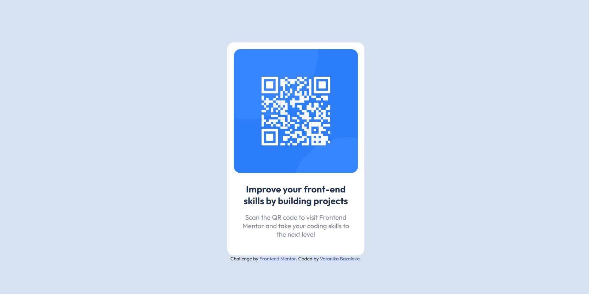

# Frontend Mentor - QR code component solution

This is a solution to the [QR code component challenge on Frontend Mentor](https://www.frontendmentor.io/challenges/qr-code-component-iux_sIO_H). Frontend Mentor challenges help you improve your coding skills by building realistic projects. 

## Table of contents

- [Overview](#overview)
  - [Screenshot](#screenshot)
  - [Links](#links)
- [My process](#my-process)
  - [Built with](#built-with)
  - [What I learned](#what-i-learned)
- [Author](#author)

## Overview

Simple web design of an QR code.

### Screenshot

### Links

- Solution URL: https://github.com/VeroBaz/qr-code-component
- Live Site URL: https://verobaz.github.io/qr-code-component/

## My process

### Built with

- HTML
- CSS
- Flexbox

### What I learned

My first challenge from Frontend Mentor. I learnt mainly how a challenge looks like, what is included in the downloaded files and what is necessary to do for a successful completion of a challenge.

I was playing around with Flexbox and how to make the text layout static on different screen widths.

## Author

- Website - [Veronika Bazalova](https://github.com/VeroBaz)
- Frontend Mentor - [@VeroBaz](https://www.frontendmentor.io/profile/yourusername)
